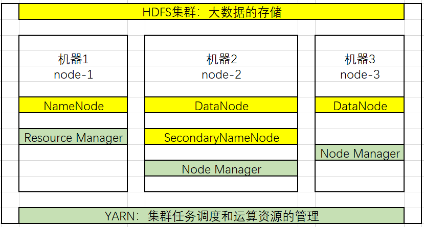

* 是一个由Apache基金会所开发的分布式系统基础架构。
* 广义上来说，是一个Hadoop生态圈（由一堆框架、软件组成）

### 版本介绍

* 分为社区版和商业版
* 1.x,2.x,-是并行发展的
  * 1.x ：
    * 由一个分布式文件系统HDFS
    * 一个离线计算机框架MapReduce 
  * 2.x：
    * 支持NameNode的HDFS
    * 资源管理系统YARN
    * 运行在YARN上的MapReduce
    * 比1的功能更强大，有更好的扩展性、性能、并支持多种计算框架
  * 3.x
    * 比2有一系列功能加强，但还在测试

### 集群介绍

* 包含两个集群，HDFS集群和YARN集群：
  * 都是分布式，可以布置在多台机器上。
  * 两者逻辑上分离，但物理常在一起：但是即使装在一台机器上，逻辑上也是分离的，就是说两个的处理完全独立，1个执行不了不影响另一个。

#### 优势

* 扩容能力：分布式系统方便的扩充
* 成本低：可以使用多台普通廉价的机器
* 高效率：通过并发数据，结点直接动态并行移动数据，速度块。
* 可靠性：自动同步备份数据

#### HDFS集群：

* 负责数据的存储。
* 集群中的角色：
  * NameNode：命名结点
  * DataNode：数据结点
  * SecondaryNameNode：秘书结点

#### YARN集群

* 负责数据运算的硬件资源调度，比如内存
* 集群中的角色
  * Resource Manager
  * Node Manager

### MapReduce

* 其实是一个分布式运算编程框架（类似一个接口和一系列父类）
* 注意并不是一个集群

### 部署方式

* Standalone mode（独立模式）：单机模式，在1个机器上运行一个Java进程，主要用于调试。
* Pseudo-Distributed mode（伪分布模式）：1个机器上运行HDFS和YARN，但是分别开启Java进程
* Cluster mode （集群模式）:实际生产使用的模式，在N台主机组成一个Hadoop集群。