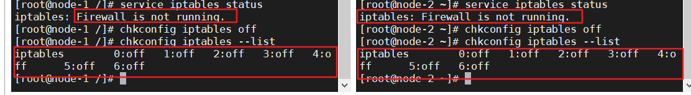

## 0.部署计划

| 主机名字 | 内存 | 硬盘 | 安装集群 |
| -------- | ---- | ---- | -------- |
| node-1   | 4    | 40   |          |
| node-2   | 4    | 40   |          |
|          |      |      |          |


## 1.VMware部署

### node-1

1. 使用rhel-server-6.8-x86_64-dvd部署虚拟机

2. 挂载本地yum源

3. 同步机组时间

   ```bash
   #yum安装ntpdate
   yum install ntpdate
   #网络同步时间
   ntpdate cn.pool.ntp.org
   ```

4. 配置主机名称

   ```bash
   vim /etc/sysconfig/network
   
   #修改为：
   NETWORKING=yes
   HOSTNAME=node-1
   ```

5. 配置IP、主机名映射

   ```bash
   vim /etc/hosts
   
   #添加
   192.168.98.129 node-1
   192.168.98.130 node-2
   ```

6. 配置ssh免密登录

   ```bash
    ssh-keygen -t rsa #再按四次回车
   Generating public/private rsa key pair.
   Enter file in which to save the key (/root/.ssh/id_rsa):
   Enter passphrase (empty for no passphrase):
   Enter same passphrase again:
   Your identification has been saved in /root/.ssh/id_rsa.
   Your public key has been saved in /root/.ssh/id_rsa.pub.
   The key fingerprint is:
   20:15:74:e0:d2:48:1d:0d:e4:42:2a:14:28:1e:b7:75 root@node-1
   The key's randomart image is:
   +--[ RSA 2048]----+
   |.o. o+O*.        |
   |+. = B.E.        |
   |+ + B *          |
   | o . + .         |
   |        S        |
   |                 |
   |                 |
   |                 |
   |                 |
   +-----------------+
   
   #讲公钥考培到要绵密登录的目标机器上
   ssh-copy-id [目标机器]
   ssh-copy-id node-1
   ```

7. 关闭防火墙

   ```bash
   #查看防火墙状态
   service iptables status
   #关闭防火墙
   service iptables stop
   #查看防火墙开机启动状态
   chkconfig iptables --list
   #关闭防火墙开机启动
   chkconfig iptables off
   ```

   如下图状态则说明防火墙已经关闭、防火墙开机不会自动启动

   

8. 安装JDK

   * 使用rpm格式文件安装
   * 复制到/usr/java文件夹（没有则先创建文件夹）

   ```bash
   #授予权限
   chmod 700 jdk-8u65-linux-x64.rpm
   #安装
   rpm -ivh jdk-8u65-linux-x64.rpm
   ```

   * 安装完成

   

9. 配置环境变量

   ```bash
   #打开全局环境变量设置
   vim  /etc/profile
   
   #在文档最下方添加配置
   JAVA_HOME=/usr/java/jdk1.8.0_65
   CLASSPATH=.:$JAVA_HOME/lib/dt.jar:$JAVA_HOME/lib/tools.jar
   PATH=$PATH:$JAVA_HOME/bin
   export PATH JAVA_HOME CLASSPATH
   
   #生效配置
   source /etc/profile
   
   #测试配置
   java -version
   ```

   配置成功：

   

10. 安装Hadoop

    * 使用tar.gz格式安装
    * 复制到/usr/hop，没路径自行创建

    ```bash
    #授予权限
    chmod 700 hadoop-2.7.7.tar.gz
    
    #解压到当前路径
    [root@node-1 hop]# tar zxvf hadoop-2.7.7.tar.gz
    
    ```

11. 配置Hadoop

    1. 配置目录：/usr/hop/hadoop-2.7.7/etc/hadoop

       * 所有配置文件都在这里

    2.  vim hadoop-env.sh

       ```bash
       #在文件中找到JAVA_HOME，修改配置
       export JAVA_HOME=/usr/java/jdk1.8.0_65
       ```

    3. vim core-site.xml

       * hadoop.tmp.dir是导出目录，注意要手动创建/export/data/hopdata

       ```bash
       <configuration>
         <property>
           <name>fs.defaultFS</name>
           <value>hdfs://node-1:9000</value>
         </property>
         <property>
           <name>hadoop.tmp.dir</name>
           <value>/export/data/hopdata</value>
         </property>
       </configuration>
       ```

    4.  vim hdfs-site.xml

       * dfs.replication是指备份的数量

       ```java
       <configuration>
         <property>
           <name>dfs.namenode.secondary.http-address</name>
           <value>node-2:50090</value>
         </property>
         <property>
           <name>dfs.replication</name>
           <value>2</value>
         </property>
       </configuration>
       
       ```

    5.  mv mapred-site.xml.template mapred-site.xml

       * 默认只有mapred-site.xml.template ，因此要改成mapred-site.xml
       * vim  mapred-site.xml
       * 指定mr运行时框架，这里指定在yarn上，默认是local

       ```bash
       
       <configuration>
         <property>
           <name>mapreduce.framework.name</name>
           <value>yarn</value>
         </property>
       </configuration>
       
       ```

    6.  vim yarn-site.xml

       ```java
       
       <configuration>
       
       <!-- Site specific YARN configuration properties -->
         <property>
           <!--指定YARN的主机(ResourceManager)的地址-->
           <name>yarn.resourcemanager.hostname</name>
           <value>node-1</value>
         </property>
         <property>
           <!--nodeManager上运行的附属服务，需要配置成maperduce_shuffle，才可用MapReduce程序-->
           <name>yarn.nodemanager.aux-services</name>
           <value>mapreduce_shuffle</value>
         </property>
       </configuration>
       
       ```

    7. vim slaves

       * 告诉hadoop有多少台机器

       ```bash
       node-1
       node-2
       ```

12. 配置Hadoop环境变量

    ```bash
    
    JAVA_HOME=/usr/java/jdk1.8.0_65
    CLASSPATH=.:$JAVA_HOME/lib/dt.jar:$JAVA_HOME/lib/tools.jar
    HADOOP_HOME=/usr/hop/hadoop-2.7.7
    PATH=$PATH:$JAVA_HOME/bin:$HADOOP_HOME/bin:$HADOOP_HOME/sbin
    export PATH JAVA_HOME CLASSPATH HADOOP_HOME
    
    ```

13. 测试环境变量配置是否成功

    ```bash
    hadoop version
    ```

    

